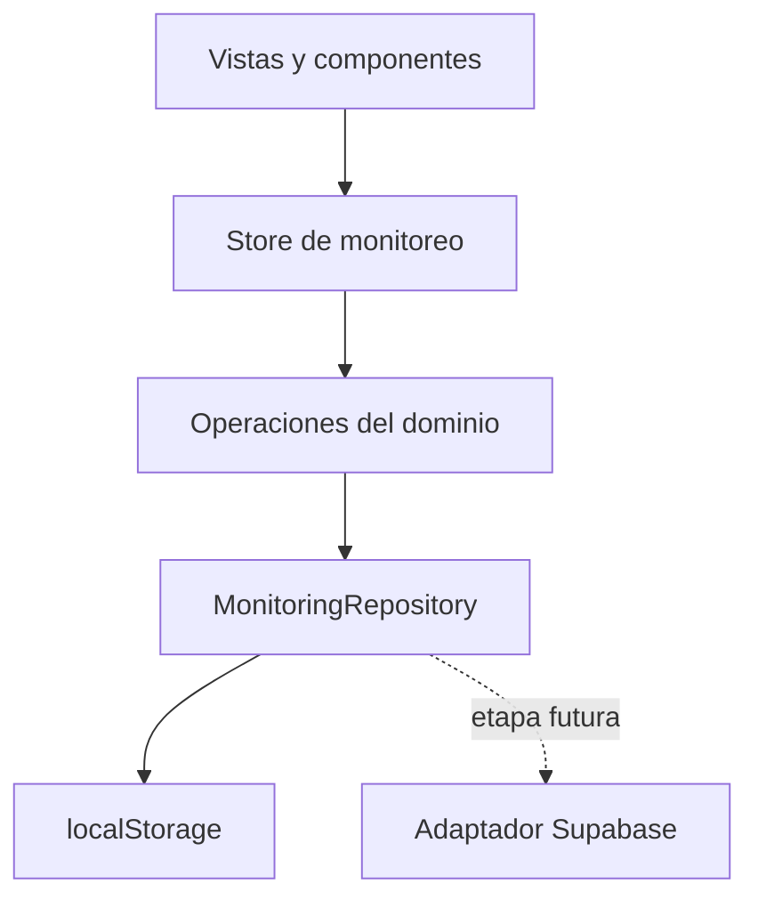

# Arquitectura de migración propuesta

## Principio

La versión 5 del Site es la fuente de verdad visual y funcional. Esta migración conserva sus pantallas, reglas y responsive, pero separa la interfaz, el dominio y la persistencia para que el proyecto funcione en Next.js estándar, fuera de ChatGPT Work.

## Capas

1. **Aplicación Next.js**: layout, metadata y composición de la página.
2. **Componentes de interfaz**: encabezado, navegación, modales y elementos reutilizables.
3. **Funcionalidades**: monitoreo, informes, historial, configuración, cursos, docentes y estudiantes.
4. **Dominio**: tipos, métricas, reglas de priorización y operaciones inmutables sobre el estado.
5. **Persistencia**: contrato `MonitoringRepository` con implementación inicial en `localStorage`.
6. **Datos de demostración**: estado reproducible con 40 estudiantes ficticios y sesiones de ejemplo.

## Flujo de datos



## Decisiones de la primera migración

- Next.js + React + TypeScript + Tailwind CSS.
- CSS original preservado para fidelidad; Tailwind queda disponible para extensiones controladas.
- Persistencia local por navegador, sin autenticación ni servidor.
- No se copia el historial Git original porque contenía nombres reales de estudiantes en commits anteriores.
- Las operaciones del dominio no dependen del navegador ni de React.
- Los exportadores PDF/Excel se cargan dinámicamente para no aumentar el JavaScript inicial.
- El contrato de repositorio permite reemplazar `localStorage` por Supabase sin cambiar las vistas.

## Estructura prevista

```text
src/
  app/                     # App Router, estilos y metadata
  components/              # Layout y UI compartida
  config/                  # Configuración de producto
  data/                    # Datos ficticios
  features/
    courses/
    history/
    monitoring/
    reports/
    settings/
    students/
    teachers/
  lib/                     # Utilidades transversales
  types/                   # Modelos del dominio
docs/
  decisions/               # ADR de arquitectura
```

## Compatibilidad futura con Supabase

La etapa actual no instala el SDK ni crea tablas. Un adaptador futuro deberá implementar las mismas operaciones de carga y guardado que `LocalStorageMonitoringRepository`. Las variables se anticipan en `.env.example`, pero quedan vacías.
